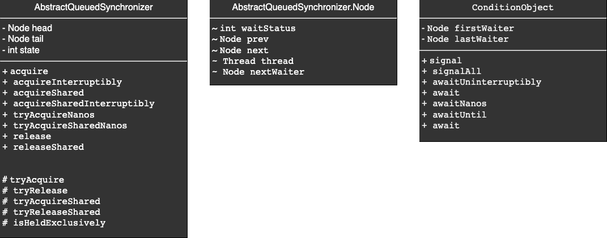
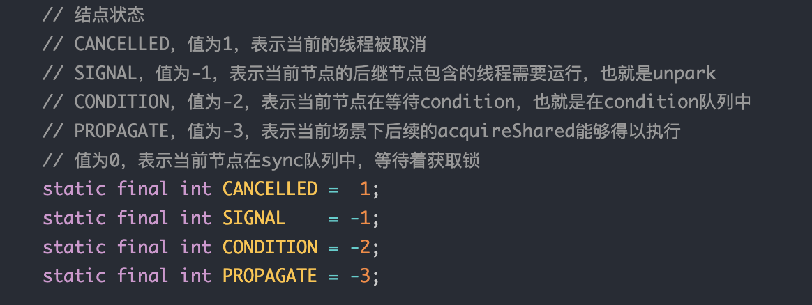
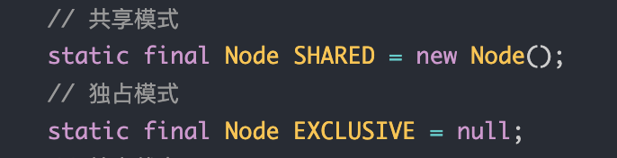
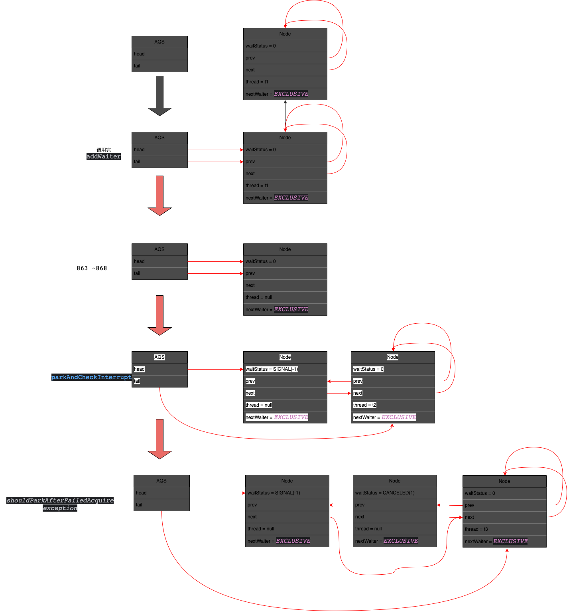

# AbstractQueuedSynchronizer

# 1. 基本信息

## 1.1 定义

0. 为构建synchronizer提供的一个模板（模板模式），基于CLH队列实现。
1. CLH队列：基于双向链表实现的FIFO队列，每个节点存储请求共享资源线程的信息。基于这个队列可以实现公平锁

## 1.2 UML



### AQS：

| 属性/方法                                                                                    | 描述                                                      |
|------------------------------------------------------------------------------------------|---------------------------------------------------------|
| head/tail                                                                                | 指向CLH的头/尾结点                                             |
| state                                                                                    | 同步状态，例如在ReentrantLock中用来记录重入的次数                         |
| accquire/<br/>accquireInterruptibly/<br/>accquireShared/<br/>accquireSharedInterruptibly | 排他获取并且忽略中断/<br/>排他获取并检查中断/<br/>共享获取并忽略中断/<br/>共享获取并检查中断 |
| tryAcquireNanos/<br/>tryAcquireSharedNanos                                               | 尝试获取，但是有限时间内未获取成功则失败                                    |
| release/<br/>releaseShared                                                               | 排他模式下释放/<br/>共享模式下释放                                    |
| tryAcquire/<br/>tryAcquireShared                                                         | 排他模式下尝试获取，被acquire调用，获取失败会park操作。需要子类覆写/<br/>共享模式下尝试获取  |
| tryRelease/<br/>tryReleaseShared                                                         | 排他模式下释放，如果返回true则会unpark操作，需要子类覆写/<br/>共享模式下...         |

### Node:

| 属性/方法      | 描述                                       |
|------------|------------------------------------------|
| waitStatus |         |
| nextWaiter | 下一个等待者  |

### ConditionObject
TBD

## 1.3 关键代码解读
### Acquire
```java
    /**
     * Acquires in exclusive mode, ignoring interrupts.  Implemented
     * by invoking at least once {@link #tryAcquire},
     * returning on success.  Otherwise the thread is queued, possibly
     * repeatedly blocking and unblocking, invoking {@link
     * #tryAcquire} until success.  This method can be used
     * to implement method {@link Lock#lock}.
     *
     * @param arg the acquire argument.  This value is conveyed to
     *        {@link #tryAcquire} but is otherwise uninterpreted and
     *        can represent anything you like.
     */
    public final void acquire(int arg) {
        if (!tryAcquire(arg) &&
            acquireQueued(addWaiter(Node.EXCLUSIVE), arg))
            selfInterrupt();
    }
```
- 调用tryAcquire成功则结束</br>
- 否则通过addWaiter(Node.EXCLUSIVE)向等待队列添加一个排他模式的节点，并且调用acquireQueued为队列中存在的节点acquire（这个方法中会park及unpark）</br>
- 如果发现等待中被中断，则会调用当前线程的interrupt方法。（相当于传中断标志传递到当前线程了）

看下如何入队的操作
```java
    /**
     * Creates and enqueues node for current thread and given mode.
     *
     * @param mode Node.EXCLUSIVE for exclusive, Node.SHARED for shared
     * @return the new node
     */
    private Node addWaiter(Node mode) {
        Node node = new Node(Thread.currentThread(), mode);
        // Try the fast path of enq; backup to full enq on failure
        Node pred = tail;
        if (pred != null) {
            node.prev = pred;
            if (compareAndSetTail(pred, node)) {
                pred.next = node;
                return node;
            }
        }
        enq(node);
        return node;
    }
    
    
    /**
     * Inserts node into queue, initializing if necessary. See picture above.
     * @param node the node to insert
     * @return node's predecessor
     */
    private Node enq(final Node node) {
        for (;;) {
            Node t = tail;
            if (t == null) { // Must initialize
                if (compareAndSetHead(new Node()))
                    tail = head;
            } else {
                node.prev = t;
                if (compareAndSetTail(t, node)) {
                    t.next = node;
                    return t;
                }
            }
        }
    }
```
- 创建一个节点
- 如果队列非空（pred = tail != null，队列空的时候tail一定是null，反之亦然），node的前驱连上pred（原tail）；CAS set新的tail，如果成功就返回了
- 否则执行enq，（1）有可能是个空队列，需要用一个新节点CAS初始化head，并最终让tail也指向这个节点（2）有可能是fast pathCAS失败（读tail和CAS是两个操作，整体非原子，可能并发的移动了tail指向的节点），无限重试直至成功

看下已入队后的acquire操作
```java

    /**
     * Acquires in exclusive uninterruptible mode for thread already in
     * queue. Used by condition wait methods as well as acquire.
     *
     * @param node the node
     * @param arg the acquire argument
     * @return {@code true} if interrupted while waiting
     */
    final boolean acquireQueued(final Node node, int arg) {
        boolean failed = true;
        try {
            boolean interrupted = false;
            for (;;) {
                final Node p = node.predecessor();
                if (p == head && tryAcquire(arg)) {
                    setHead(node);
                    p.next = null; // help GC
                    failed = false;
                    return interrupted;
                }
                if (shouldParkAfterFailedAcquire(p, node) &&
                    parkAndCheckInterrupt())
                    interrupted = true;
            }
        } finally {
            if (failed)
                cancelAcquire(node);
        }
    }
    
    
    /**
     * Checks and updates status for a node that failed to acquire.
     * Returns true if thread should block. This is the main signal
     * control in all acquire loops.  Requires that pred == node.prev.
     *
     * @param pred node's predecessor holding status
     * @param node the node
     * @return {@code true} if thread should block
     */
    private static boolean shouldParkAfterFailedAcquire(Node pred, Node node) {
        int ws = pred.waitStatus;
        if (ws == Node.SIGNAL)
            /*
             * This node has already set status asking a release
             * to signal it, so it can safely park.
             */
            return true;
        if (ws > 0) {
            /*
             * Predecessor was cancelled. Skip over predecessors and
             * indicate retry.
             */
            do {
                node.prev = pred = pred.prev;
            } while (pred.waitStatus > 0);
            pred.next = node;
        } else {
            /*
             * waitStatus must be 0 or PROPAGATE.  Indicate that we
             * need a signal, but don't park yet.  Caller will need to
             * retry to make sure it cannot acquire before parking.
             */
            compareAndSetWaitStatus(pred, ws, Node.SIGNAL);
        }
        return false;
    }

    /**
     * Convenience method to park and then check if interrupted
     *
     * @return {@code true} if interrupted
     */
    private final boolean parkAndCheckInterrupt() {
        LockSupport.park(this);
        return Thread.interrupted();
    }


    /**
     * Cancels an ongoing attempt to acquire.
     *
     * @param node the node
     */
    private void cancelAcquire(Node node) {
        // Ignore if node doesn't exist
        if (node == null)
            return;

        node.thread = null;

        // Skip cancelled predecessors
        Node pred = node.prev;
        while (pred.waitStatus > 0)
            node.prev = pred = pred.prev;

        // predNext is the apparent node to unsplice. CASes below will
        // fail if not, in which case, we lost race vs another cancel
        // or signal, so no further action is necessary.
        Node predNext = pred.next;

        // Can use unconditional write instead of CAS here.
        // After this atomic step, other Nodes can skip past us.
        // Before, we are free of interference from other threads.
        node.waitStatus = Node.CANCELLED;

        // If we are the tail, remove ourselves.
        if (node == tail && compareAndSetTail(node, pred)) {
            compareAndSetNext(pred, predNext, null);
        } else {
        // If successor needs signal, try to set pred's next-link
        // so it will get one. Otherwise wake it up to propagate.
        int ws;
        if (pred != head &&
        ((ws = pred.waitStatus) == Node.SIGNAL ||
        (ws <= 0 && compareAndSetWaitStatus(pred, ws, Node.SIGNAL))) &&
        pred.thread != null) {
            Node next = node.next;
            if (next != null && next.waitStatus <= 0)
                compareAndSetNext(pred, predNext, next);
            } else {
                unparkSuccessor(node);
            }

        node.next = node; // help GC
        }
    }


    /**
     * Wakes up node's successor, if one exists.
     *
     * @param node the node
     */
    private void unparkSuccessor(Node node) {
        /*
         * If status is negative (i.e., possibly needing signal) try
         * to clear in anticipation of signalling.  It is OK if this
         * fails or if status is changed by waiting thread.
         */
        int ws = node.waitStatus;
        if (ws < 0)
        compareAndSetWaitStatus(node, ws, 0);

        /*
         * Thread to unpark is held in successor, which is normally
         * just the next node.  But if cancelled or apparently null,
         * traverse backwards from tail to find the actual
         * non-cancelled successor.
         */
        Node s = node.next;
        if (s == null || s.waitStatus > 0) {
        s = null;
        for (Node t = tail; t != null && t != node; t = t.prev)
        if (t.waitStatus <= 0)
        s = t;
        }
        if (s != null)
        LockSupport.unpark(s.thread);
        }
```
- 看acquireQueued循环中的代码，
  - (1)如果当前的前驱是head并且tryAcquire成功，则把当前设为head（setHead中会把prev和thread设为null）,然后摘除老的头节点使能被GC
  - (2)否则执行shouldParkAfterFailedAcquire：
    - 如果前序节点已是Signal了则直接返回true，
    - 否则跳过所有前序canceled节点并连上第一个非canceled节点并返回false
    - 否则把前序的设置为signal并返回true
    - 再执行parkAndCheckInterrupt，简单的park并且unpark后返回线程是否被中断
  - (3) finally检查failed是否为true（目测这种情况只能是在try中由于抛出异常而执行失败了），如果不是则cancelAcquire：
    - 清空thread字段
    - 跳过前序的canceled节点
    - 如果我们已经是tail了，则CAS的把前序节点的后驱设为null
    - 否则如果前驱节已经是signal了或者<0可以被设为signal，则当后续非空非canceled尝试连到当前节点的后驱节点（注意CAS可能会失败），否则unparkSuccessor：
      - 如果当前节点非canceled，则设为0（CAS可能不成功）
      - 如果后继是null或canceled则从后向前遍历找到最前一个非canceled的节点unpark它。

FAQ：
1. 并发分析

2. 为什么出现interrupt后要在acquire方法中调用selfInterrupt？
   parkAndCheckInterrupt()调用Thread.interrupted()判断是否发生中断会清除中断标记位，因此要重新调用为什么出现interrupt后要在acquire方法中调用selfInterrupt调t.interrupt()方法设置一下
3. 状态机
   
4. 节点变更的场景
5. 概括的总结
6. unparkSuccessor为什么遇到下个节点是null或者是取消态时从后往前找
拆解下问题：
   - 什么时候会出现null：明显首先node是尾节点时；其次addWaiter方法中会先设置当前节点的前驱为tail，CAS成功后tail指向当前节点。此前会是null
   - 什么时候会出现waitStatus是1（取消）：当后驱节点的线程执行cancelAcquire取消了获取资源时。
   - 为什么从前往后会有问题：为null不用说，cancelAcquire的最后一行是node.next = node;因此如果下一个节点是取消态，它有可能指向自己，导致无限循环。
   - 为什么从后往前功能上不会有问题：prev只有在执行setHead成为头结点才会变为null，以及跳过前序取消节点时才会更改。没有其他变更的情况。这两种情况下都不影响找到正确的节点。
   - 性能上会有问题吗：是个O(n)的操作，线程很多会有问题

### release
```java

    /**
     * Releases in exclusive mode.  Implemented by unblocking one or
     * more threads if {@link #tryRelease} returns true.
     * This method can be used to implement method {@link Lock#unlock}.
     *
     * @param arg the release argument.  This value is conveyed to
     *        {@link #tryRelease} but is otherwise uninterpreted and
     *        can represent anything you like.
     * @return the value returned from {@link #tryRelease}
     */
    public final boolean release(int arg) {
        if (tryRelease(arg)) {
            Node h = head;
            if (h != null && h.waitStatus != 0)
                unparkSuccessor(h);
            return true;
        }
        return false;
    }
```
非常简单，unparkSuccessor前面分析了。注意release不会改变头结点，头结点是在下一个节点的线程执行acquireQueued方法中的循环时执行setHead重置的


### acquireShared
```java
/**
     * Acquires in shared mode, ignoring interrupts.  Implemented by
     * first invoking at least once {@link #tryAcquireShared},
     * returning on success.  Otherwise the thread is queued, possibly
     * repeatedly blocking and unblocking, invoking {@link
     * #tryAcquireShared} until success.
     *
     * @param arg the acquire argument.  This value is conveyed to
     *        {@link #tryAcquireShared} but is otherwise uninterpreted
     *        and can represent anything you like.
     */
    public final void acquireShared(int arg) {
        if (tryAcquireShared(arg) < 0)
            doAcquireShared(arg);
    }


    /**
     * Acquires in shared uninterruptible mode.
     * @param arg the acquire argument
     */
    private void doAcquireShared(int arg) {
        final Node node = addWaiter(Node.SHARED);
        boolean failed = true;
        try {
            boolean interrupted = false;
            for (;;) {
                final Node p = node.predecessor();
                if (p == head) {
                int r = tryAcquireShared(arg); // (A)
                if (r >= 0) {
                    setHeadAndPropagate(node, r);
                    p.next = null; // help GC
                    if (interrupted)
                        selfInterrupt();
                    failed = false;
                    return;
                }
            }
            if (shouldParkAfterFailedAcquire(p, node) &&
                parkAndCheckInterrupt())
                interrupted = true;
            }
        } finally {
            if (failed)
            cancelAcquire(node);
        }
    }


    /**
     * Sets head of queue, and checks if successor may be waiting
     * in shared mode, if so propagating if either propagate > 0 or
     * PROPAGATE status was set.
     *
     * @param node the node
     * @param propagate the return value from a tryAcquireShared
 */
    private void setHeadAndPropagate(Node node, int propagate) {
        Node h = head; // Record old head for check below
        setHead(node);
        /*
         * Try to signal next queued node if:
         *   Propagation was indicated by caller,
         *     or was recorded (as h.waitStatus either before
         *     or after setHead) by a previous operation
         *     (note: this uses sign-check of waitStatus because
         *      PROPAGATE status may transition to SIGNAL.)
         * and
         *   The next node is waiting in shared mode,
         *     or we don't know, because it appears null
         *
         * The conservatism in both of these checks may cause
         * unnecessary wake-ups, but only when there are multiple
         * racing acquires/releases, so most need signals now or soon
         * anyway.
         */
        if (propagate > 0 || h == null || h.waitStatus < 0 ||
        (h = head) == null || h.waitStatus < 0) { // (B)
            Node s = node.next;
            if (s == null || s.isShared())
                doReleaseShared();
        }
    }

    /**
     * Release action for shared mode -- signals successor and ensures
     * propagation. (Note: For exclusive mode, release just amounts
     * to calling unparkSuccessor of head if it needs signal.)
     */
    private void doReleaseShared() {
        /*
         * Ensure that a release propagates, even if there are other
         * in-progress acquires/releases.  This proceeds in the usual
         * way of trying to unparkSuccessor of head if it needs
         * signal. But if it does not, status is set to PROPAGATE to
         * ensure that upon release, propagation continues.
         * Additionally, we must loop in case a new node is added
         * while we are doing this. Also, unlike other uses of
         * unparkSuccessor, we need to know if CAS to reset status
         * fails, if so rechecking.
         */
        for (;;) {
            Node h = head;
            if (h != null && h != tail) {
                int ws = h.waitStatus;
                if (ws == Node.SIGNAL) { // (C)
                    if (!compareAndSetWaitStatus(h, Node.SIGNAL, 0))
                        continue;            // loop to recheck cases
                    unparkSuccessor(h);
                }
                else if (ws == 0 &&
                    !compareAndSetWaitStatus(h, 0, Node.PROPAGATE))
                    continue;                // loop on failed CAS
            }
            if (h == head)                   // loop if head changed
                break;
            }
        }
    }
```
(A)处：会返回大于0的值如果获取成功并且允许后续share-mode的获取成功
(B)处：仅看我们的场景，r>0时一定会进入。注意s.isShared()判断的是nextWaiter是否是SHARED
(C)处：如果是SIGNAL则会唤醒后续的node的线程，否则置为PROPAGATE。注意如果期间head发生变化需要重试

FAQ：
doReleaseShared()的一些问题，与并发相关：
1.为啥会有个尝试设置为PROPAGATE的操作？咱未发现用途，不设置或设成任意赋值有什么区别
2. 为啥头结点改变要继续循环？未知

### releaseShared
```java

    /**
     * Releases in shared mode.  Implemented by unblocking one or more
     * threads if {@link #tryReleaseShared} returns true.
     *
     * @param arg the release argument.  This value is conveyed to
     *        {@link #tryReleaseShared} but is otherwise uninterpreted
     *        and can represent anything you like.
     * @return the value returned from {@link #tryReleaseShared}
     */
    public final boolean releaseShared(int arg) {
        if (tryReleaseShared(arg)) {
            doReleaseShared();
            return true;
        }
        return false;
    }
```
同样非常简单，直接调了doReleaseShared()


