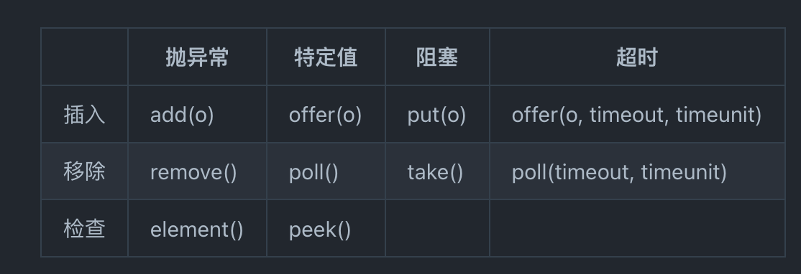
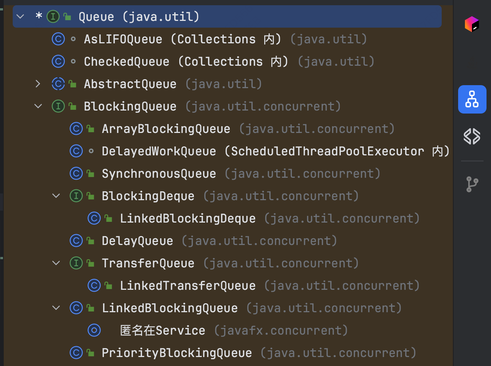

# BlockingQueue
他是一个接口！支持并发中的生产者消费者模式。同时还支持其他三组操作。

是并发中的生产消费模型的实现，常用于线程池用于存储任务，由线程池中的线程取出执行。
其有一个类似的兄弟接口BlockingDeque
继承关系如下：

## 1. ArrayBlockingQueue
基于双指针循环数组实现的有界FIFO队列，底层是一个reentrant lock和两个条件变量notEmpty和notFull。put/offer入队操作时若队列满会
将线程阻塞并放入notFull变量上等待，否则将会signalnotEmpty上的变量。而take/poll则相反。初始话时支持指定线程唤醒是否是公平的，底层由构造
一个公平/非公平的reentrant lock实现。
### 1.1 结构
### 1.2 关键代码解读
#### 1.2.1 put
```java
    /**
     * Inserts the specified element at the tail of this queue, waiting
     * for space to become available if the queue is full.
     *
     * @throws InterruptedException {@inheritDoc}
     * @throws NullPointerException {@inheritDoc}
     */
    public void put(E e) throws InterruptedException {
        checkNotNull(e);
        final ReentrantLock lock = this.lock;
        lock.lockInterruptibly();
        try {
            while (count == items.length)
                // await操作会将线程移到notFull的等待队列并释放关联的lock。被signal后会从notFull的队列移回lock的队列并尝试获取lock
                notFull.await(); 
            enqueue(e);
        } finally {
            lock.unlock();
        }
    }

    /**
     * Inserts element at current put position, advances, and signals.
     * Call only when holding lock.
     */
    private void enqueue(E x) {
    // assert lock.getHoldCount() == 1;
    // assert items[putIndex] == null;
        final Object[] items = this.items;
        items[putIndex] = x;
        if (++putIndex == items.length)
            putIndex = 0;
        count++;
        notEmpty.signal();
    }
```
#### 1.2.2 take
```java
    public E take() throws InterruptedException {
        final ReentrantLock lock = this.lock;
        lock.lockInterruptibly();
        try {
            while (count == 0)
                notEmpty.await();
            return dequeue();
        } finally {
            lock.unlock();
        }
    }

    /**
     * Extracts element at current take position, advances, and signals.
     * Call only when holding lock.
     */
    private E dequeue() {
        // assert lock.getHoldCount() == 1;
        // assert items[takeIndex] != null;
        final Object[] items = this.items;
        @SuppressWarnings("unchecked")
        E x = (E) items[takeIndex];
        items[takeIndex] = null;
        if (++takeIndex == items.length)
        takeIndex = 0;
        count--;
        if (itrs != null)
        itrs.elementDequeued();
        notFull.signal();
        return x;
    }
```
可见以上两个方法由于要操作条件变量，初始必须获取锁

## 2. LinkedBlockingQueue
链表版本的阻塞队列，原理和ArrayBlockingQueue，不过（1）可以无界（2）不支持公平模式 （3）并且put和take分成两把锁，并发性能会好一些

## 3. PriorityBlockingQueue
无界优先阻塞队列，会在队列空取时阻塞。底层和优先队列一样都是数组实现的堆（子元素大/小于父元素的完全二叉树），在put和take时全局加锁，并且take空时await。

## 4. SynchronousQueue
任何put操作必须等待对应的一个take操作取走元素，反之亦然，否则会阻塞。类似于go中的无缓冲channel。

