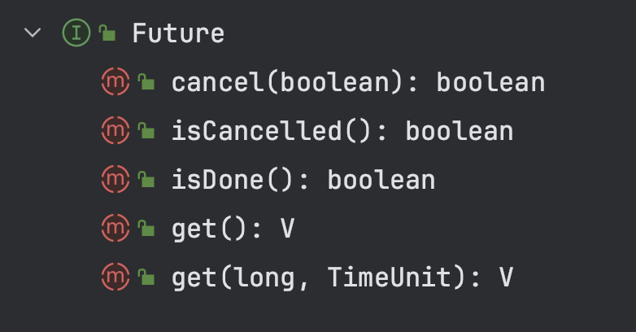
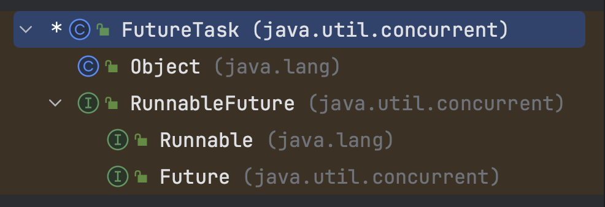
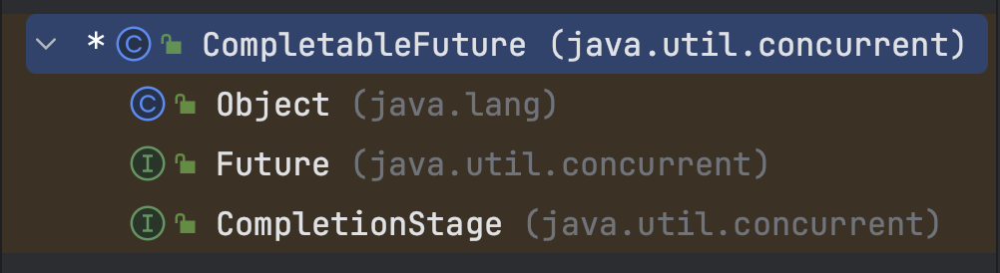

# Future
## 1. 含义
Future是一个接口，代表一个异步任务（对callable/runnable方法的异步执行）的执行过程，其支持的操作如下：

主要的操作支持获取结果、显示获取结果和取消执行。
Future是其一个实现类，继承关系如下

它额外还实现了Runnable因此可以放到线程中去执行。

CompletableFuture是其另一个实现，继承关系如下：

它额外实现了CompletionStage，即支持在其完成时执行额外的动作，这就支持了FutureTask不支持的回调并方便编排异步方法之间的依赖。

## 2. 关键代码
### 2.1 FutureTask
#### 2.1.1 字段：
```java

    /**
     * The run state of this task, initially NEW.  The run state
     * transitions to a terminal state only in methods set,
     * setException, and cancel.  During completion, state may take on
     * transient values of COMPLETING (while outcome is being set) or
     * INTERRUPTING (only while interrupting the runner to satisfy a
     * cancel(true)). Transitions from these intermediate to final
     * states use cheaper ordered/lazy writes because values are unique
     * and cannot be further modified.
     *
     * Possible state transitions:
     * NEW -> COMPLETING -> NORMAL
     * NEW -> COMPLETING -> EXCEPTIONAL
     * NEW -> CANCELLED
     * NEW -> INTERRUPTING -> INTERRUPTED
     */
    private volatile int state;
    private static final int NEW          = 0;
    private static final int COMPLETING   = 1;
    private static final int NORMAL       = 2;
    private static final int EXCEPTIONAL  = 3;
    private static final int CANCELLED    = 4;
    private static final int INTERRUPTING = 5;
    private static final int INTERRUPTED  = 6;

    /** The underlying callable; nulled out after running */
    private Callable<V> callable;
    /** The result to return or exception to throw from get() */
    private Object outcome; // non-volatile, protected by state reads/writes
    /** The thread running the callable; CASe d during run() */
    private volatile Thread runner;
    /** Treiber stack of waiting threads */
    private volatile WaitNode waiters;

```
> 主要关注状态流转：
> - NEW:表示是个新的任务或者还没被执行完的任务。这是初始状态。
> - COMPLETING:任务已经执行完成或者执行任务的时候发生异常，但是任务执行结果或者异常原因还没有保存到outcome字段(outcome字段用来保存任务执行结果，如果发生异常，则用来保存异常原因)的时候，状态会从NEW变更到COMPLETING。但是这个状态会时间会比较短，属于中间状态。
> - NORMAL:任务已经执行完成并且任务执行结果已经保存到outcome字段，状态会从COMPLETING转换到NORMAL。这是一个最终态。
> - EXCEPTIONAL:任务执行发生异常并且异常原因已经保存到outcome字段中后，状态会从COMPLETING转换到EXCEPTIONAL。这是一个最终态。
> - CANCELLED:任务还没开始执行或者已经开始执行但是还没有执行完成的时候，用户调用了cancel(false)方法取消任务且不中断任务执行线程，这个时候状态会从NEW转化为CANCELLED状态。这是一个最终态。
> - INTERRUPTING: 任务还没开始执行或者已经执行但是还没有执行完成的时候，用户调用了cancel(true)方法取消任务并且要中断任务执行线程但是还没有中断任务执行线程之前，状态会从NEW转化为INTERRUPTING。这是一个中间状态。
> - INTERRUPTED:调用interrupt()中断任务执行线程之后状态会从INTERRUPTING转换到INTERRUPTED。这是一个最终态。 有一点需要注意的是，所有值大于COMPLETING的状态都表示任务已经执行完成(任务正常执行完成，任务执行异常或者任务被取消)。


#### 2.1.2 构造器
```java

    /**
     * Creates a {@code FutureTask} that will, upon running, execute the
     * given {@code Callable}.
     *
     * @param  callable the callable task
     * @throws NullPointerException if the callable is null
     */
    public FutureTask(Callable<V> callable) {
        if (callable == null)
            throw new NullPointerException();
        this.callable = callable;
        this.state = NEW;       // ensure visibility of callable
    }

    /**
     * Creates a {@code FutureTask} that will, upon running, execute the
     * given {@code Runnable}, and arrange that {@code get} will return the
     * given result on successful completion.
     *
     * @param runnable the runnable task
     * @param result the result to return on successful completion. If
     * you don't need a particular result, consider using
     * constructions of the form:
     * {@code Future<?> f = new FutureTask<Void>(runnable, null)}
     * @throws NullPointerException if the runnable is null
     */
    public FutureTask(Runnable runnable, V result) {
        this.callable = Executors.callable(runnable, result);
        this.state = NEW;       // ensure visibility of callable
    }
```
由于FutureTask执行成功后需要返回一个结果，所以构造一般传一个Callable对象；当传Runnable时需要指定执行成功的返回结果

#### 2.1.3 cancel
```java
    public boolean cancel(boolean mayInterruptIfRunning) {
        if (!(state == NEW &&
              UNSAFE.compareAndSwapInt(this, stateOffset, NEW,
                  mayInterruptIfRunning ? INTERRUPTING : CANCELLED)))
            return false;
        try {    // in case call to interrupt throws exception
            if (mayInterruptIfRunning) {
                try {
                    Thread t = runner;
                    if (t != null)
                        t.interrupt();
                } finally { // final state
                    UNSAFE.putOrderedInt(this, stateOffset, INTERRUPTED);
                }
            }
        } finally {
            finishCompletion();
        }
        return true;
    }
    

    /**
     * Removes and signals all waiting threads, invokes done(), and
     * nulls out callable.
     */
    private void finishCompletion() {
        // assert state > COMPLETING;
        for (WaitNode q; (q = waiters) != null;) {
            if (UNSAFE.compareAndSwapObject(this, waitersOffset, q, null)) {
                for (;;) {
                    Thread t = q.thread;
                    if (t != null) {
                        q.thread = null;
                        LockSupport.unpark(t);
                    }
                    WaitNode next = q.next;
                    if (next == null)
                        break;
                    q.next = null; // unlink to help gc
                    q = next;
                }
                break;
            }
        }

        done();

        callable = null;        // to reduce footprint
    }
```
mayInterruptIfRunning的含义是如果任务正在执行是否要中断它，否的话则允许任务正常结束。结束后唤醒等待的所有线程

#### 2.1.4 get
```java
    /**
     * @throws CancellationException {@inheritDoc}
     */
    public V get() throws InterruptedException, ExecutionException {
        int s = state;
        if (s <= COMPLETING)
            s = awaitDone(false, 0L);
        return report(s);
    }
    
    
    /**
     * Awaits completion or aborts on interrupt or timeout.
     *
     * @param timed true if use timed waits
     * @param nanos time to wait, if timed
     * @return state upon completion
     */
    private int awaitDone(boolean timed, long nanos)
        throws InterruptedException {
        final long deadline = timed ? System.nanoTime() + nanos : 0L;
        WaitNode q = null;
        boolean queued = false;
        for (;;) {
            if (Thread.interrupted()) {
                removeWaiter(q);
                throw new InterruptedException();
            }

            int s = state;
            if (s > COMPLETING) {
                if (q != null)
                    q.thread = null;
                return s;
            }
            else if (s == COMPLETING) // cannot time out yet
                Thread.yield();
            else if (q == null)
                q = new WaitNode();
            else if (!queued)
                queued = UNSAFE.compareAndSwapObject(this, waitersOffset,
                                                     q.next = waiters, q);
            else if (timed) {
                nanos = deadline - System.nanoTime();
                if (nanos <= 0L) {
                    removeWaiter(q);
                    return state;
                }
                LockSupport.parkNanos(this, nanos);
            }
            else
                LockSupport.park(this);
        }
    }
    
    
    /**
     * Returns result or throws exception for completed task.
     *
     * @param s completed state value
     */
    @SuppressWarnings("unchecked")
    private V report(int s) throws ExecutionException {
        Object x = outcome;
        if (s == NORMAL)
            return (V)x;
        if (s >= CANCELLED)
            throw new CancellationException();
        throw new ExecutionException((Throwable)x);
    }
```
主要做的事情就是（1）等待计算完成，必要时加入队列并park等待唤醒，处理被中断和超时的等待线程。（2）结束后根据状态汇报结果或异常

#### 2.1.5 run
```agsl
public void run() {
        // cas线程id保证并发时callable只会被一个线程执行
        if (state != NEW ||
            !UNSAFE.compareAndSwapObject(this, runnerOffset,
                                         null, Thread.currentThread()))
            return;
        try {
            Callable<V> c = callable;
            if (c != null && state == NEW) {
                V result;
                boolean ran;
                try {
                    result = c.call();
                    ran = true;
                } catch (Throwable ex) {
                    result = null;
                    ran = false;
                    setException(ex);
                }
                if (ran)
                    set(result);
            }
        } finally {
            // runner must be non-null until state is settled to
            // prevent concurrent calls to run()
            runner = null;
            // state must be re-read after nulling runner to prevent
            // leaked interrupts
            int s = state;
            if (s >= INTERRUPTING)
                handlePossibleCancellationInterrupt(s);
        }
    }
    
    
    /**
     * Causes this future to report an {@link ExecutionException}
     * with the given throwable as its cause, unless this future has
     * already been set or has been cancelled.
     *
     * <p>This method is invoked internally by the {@link #run} method
     * upon failure of the computation.
     *
     * @param t the cause of failure
     */
    protected void setException(Throwable t) {
        if (UNSAFE.compareAndSwapInt(this, stateOffset, NEW, COMPLETING)) {
            outcome = t;
            UNSAFE.putOrderedInt(this, stateOffset, EXCEPTIONAL); // final state
            finishCompletion();
        }
    }
    
    
    /**
     * Sets the result of this future to the given value unless
     * this future has already been set or has been cancelled.
     *
     * <p>This method is invoked internally by the {@link #run} method
     * upon successful completion of the computation.
     *
     * @param v the value
     */
    protected void set(V v) {
        if (UNSAFE.compareAndSwapInt(this, stateOffset, NEW, COMPLETING)) {
            outcome = v;
            UNSAFE.putOrderedInt(this, stateOffset, NORMAL); // final state
            finishCompletion();
        }
    }
    
    
    /**
     * Ensures that any interrupt from a possible cancel(true) is only
     * delivered to a task while in run or runAndReset.
     */
    private void handlePossibleCancellationInterrupt(int s) {
        // It is possible for our interrupter to stall before getting a
        // chance to interrupt us.  Let's spin-wait patiently.
        // 等待中断线程调cancel设置完状态后再退出
        if (s == INTERRUPTING)
            while (state == INTERRUPTING)
                Thread.yield(); // wait out pending interrupt

        // assert state == INTERRUPTED;

        // We want to clear any interrupt we may have received from
        // cancel(true).  However, it is permissible to use interrupts
        // as an independent mechanism for a task to communicate with
        // its caller, and there is no way to clear only the
        // cancellation interrupt.
        //
        // Thread.interrupted();
    }
```

## 2.2 CompletableFuture
### 2.2.1 CompletionStage
首先看下CompletableFuture实现的另外一个接口CompletionStage的定义。
CompletionStage代表整个异步计算过程中的某个状态。这个状态由上一个或几个状态计算完成后流转到。当前状态完成后会用当前的计算结果（或者结合其他状态的计算结果）触发下一个状态的计算。


可见方法的命名遵循以下的规则：
- 仅根据当前结果计算：执行Runnable/Consumer/Function；
- 根据当前和其他stage的结果计算：执行Runnable/BiConsumer/BiFunction，其中和其他stage可能是Either或Both的关系
- 同步或异步（Async后缀）
- 出现异常时的计算（如exceptionally），以及无论正常异常都会执行的计算（whenComplete）
### 2.2.2 CompletableFuture
#### 2.2.2.1 0元依赖：supplyAsync&runAsync
```java

    
    /**
     * Returns a new CompletableFuture that is asynchronously completed
     * by a task running in the given executor with the value obtained
     * by calling the given Supplier.
     *
     * @param supplier a function returning the value to be used
     * to complete the returned CompletableFuture
     * @param executor the executor to use for asynchronous execution
     * @param <U> the function's return type
     * @return the new CompletableFuture
     */
     // 不指定线程池的话会使用ForkJoinPool#commonPool
    public static <U> CompletableFuture<U> supplyAsync(Supplier<U> supplier,
                                                       Executor executor) {
        return asyncSupplyStage(screenExecutor(executor), supplier);
    }
    
    static <U> CompletableFuture<U> asyncSupplyStage(Executor e,
                                                     Supplier<U> f) {
        if (f == null) throw new NullPointerException();
        CompletableFuture<U> d = new CompletableFuture<U>();
        e.execute(new AsyncSupply<U>(d, f));
        return d;
    }
    
    static final class AsyncSupply<T> extends ForkJoinTask<Void>
            implements Runnable, AsynchronousCompletionTask {
        CompletableFuture<T> dep; Supplier<T> fn;
        AsyncSupply(CompletableFuture<T> dep, Supplier<T> fn) {
            this.dep = dep; this.fn = fn;
        }

        public final Void getRawResult() { return null; }
        public final void setRawResult(Void v) {}
        public final boolean exec() { run(); return true; }

        public void run() {
            CompletableFuture<T> d; Supplier<T> f;
            if ((d = dep) != null && (f = fn) != null) {
                dep = null; fn = null;
                if (d.result == null) {
                    try {
                        // 还没有计算完结果，调Supplier的get方法，CAS设置结果
                        d.completeValue(f.get());
                    } catch (Throwable ex) {
                        // 执行出现异常，使用AltResult和CompletionException层层封装异常
                        d.completeThrowable(ex);
                    }
                }
                d.postComplete();
            }
        }
    }
    
    
    /** Completes with a non-exceptional result, unless already completed. */
    final boolean completeValue(T t) {
        return UNSAFE.compareAndSwapObject(this, RESULT, null,
                                           (t == null) ? NIL : t);
    }
    
    /** Completes with an exceptional result, unless already completed. */
    final boolean completeThrowable(Throwable x) {
        return UNSAFE.compareAndSwapObject(this, RESULT, null,
                                           encodeThrowable(x));
    }
    
    
    /**
     * Returns the encoding of the given (non-null) exception as a
     * wrapped CompletionException unless it is one already.
     */
    static AltResult encodeThrowable(Throwable x) {
        return new AltResult((x instanceof CompletionException) ? x :
                             new CompletionException(x));
    }
```
supplyAsync不依赖任何CompletableFuture（这个方法并不在CompletionStage的原因应该也是如此），事一个static方法。执行的函数接口是Supplier，0入参有返回值，常用在流程的入口创建第一个stage。
镜像的null返回值方法：runAsync（执行完会用AltResult(null)设置结果）

#### 2.2.2.2 一元依赖：thenApply(Async)&thenAccept(Async)&thenRun(Async)
注意thenRun(Async)虽然不需要入参，但会等上一个stage执行完再执行。比较奇怪的是没有thenSupply(Async) 0入参有返回值，不过能用thenApply(Async)替代就是了
```agsl
    public <U> CompletableFuture<U> thenApplyAsync(
        Function<? super T,? extends U> fn) {
        return uniApplyStage(asyncPool, fn);
    }
    
    private <V> CompletableFuture<V> uniApplyStage(
        Executor e, Function<? super T,? extends V> f) {
        if (f == null) throw new NullPointerException();
        CompletableFuture<V> d =  new CompletableFuture<V>();
        // 不带async的同步方法e是null，此时会直接调uniApply尝试计算结果看是否成功；否则推入栈中去计算。
        if (e != null || !d.uniApply(this, f, null)) {
            UniApply<T,V> c = new UniApply<T,V>(e, d, this, f);
            // 入栈
            push(c);
            // 计算当前stage的结果，然后触发下游stage的f方法
            c.tryFire(SYNC);
        }
        return d;
    }   
    
    final <S> boolean uniApply(CompletableFuture<S> a,
                               Function<? super S,? extends T> f,
                               UniApply<S,T> c) {
        Object r; Throwable x;
        // 如果当前stage的结果是null（没计算完）则不会计算并返回false
        if (a == null || (r = a.result) == null || f == null)
            return false;
        tryComplete: if (result == null) {
            if (r instanceof AltResult) {
                if ((x = ((AltResult)r).ex) != null) {
                    completeThrowable(x, r);
                    break tryComplete;
                }
                r = null;
            }
            try {
                //  !c.claim()已经被其他线程计算过了，不重新计算
                if (c != null && !c.claim())
                    return false;
                @SuppressWarnings("unchecked") S s = (S) r;
                completeValue(f.apply(s));
            } catch (Throwable ex) {
                completeThrowable(ex);
            }
        }
        return true;
    }
    
    
    /** A Completion with a source, dependent, and executor. */
    @SuppressWarnings("serial")
    abstract static class UniCompletion<T,V> extends Completion {
        Executor executor;                 // executor to use (null if none)
        CompletableFuture<V> dep;          // the dependent to complete
        CompletableFuture<T> src;          // source for action

        UniCompletion(Executor executor, CompletableFuture<V> dep,
                      CompletableFuture<T> src) {
            this.executor = executor; this.dep = dep; this.src = src;
        }

        /**
         * Returns true if action can be run. Call only when known to
         * be triggerable. Uses FJ tag bit to ensure that only one
         * thread claims ownership.  If async, starts as task -- a
         * later call to tryFire will run action.
         */
        final boolean claim() {
            Executor e = executor;
            if (compareAndSetForkJoinTaskTag((short)0, (short)1)) {
                // 可（同步）执行
                if (e == null)
                    return true;
                executor = null; // disable
                // 提交线程池去异步执行了，后面return false禁止同步执行
                // 线程池线程执行run方法：public final void run() { tryFire(ASYNC); }
                e.execute(this);
            }
            return false;
        }

        final boolean isLive() { return dep != null; }
    }
    
    
    
    /** Pushes the given completion (if it exists) unless done. */
    final void push(UniCompletion<?,?> c) {
        if (c != null) {
            // 当前stage未计算完成时尝试入栈，如果入栈失败（发生在结果已经被计算完时）会清除掉next的引用
            while (result == null && !tryPushStack(c))
                lazySetNext(c, null); // clear on failure
        }
    }
    
    
    /** Returns true if successfully pushed c onto stack. */
    final boolean tryPushStack(Completion c) {
        Completion h = stack;
        // 设置next的引用（指向栈底方向）
        lazySetNext(c, h);
        // 设置栈顶
        return UNSAFE.compareAndSwapObject(this, STACK, h, c);
    }
    
    static void lazySetNext(Completion c, Completion next) {
        // 设置引用，并立即对所有线程可见
        UNSAFE.putOrderedObject(c, NEXT, next);
    }
    
    // Modes for Completion.tryFire. Signedness matters.
    static final int SYNC   =  0;
    static final int ASYNC  =  1;
    static final int NESTED = -1;
    
    static final class UniApply<T,V> extends UniCompletion<T,V> {
        Function<? super T,? extends V> fn;
        UniApply(Executor executor, CompletableFuture<V> dep,
                 CompletableFuture<T> src,
                 Function<? super T,? extends V> fn) {
            super(executor, dep, src); this.fn = fn;
        }
        final CompletableFuture<V> tryFire(int mode) {
            CompletableFuture<V> d; CompletableFuture<T> a;
            
            // 计算下游stage的结果，当然可能当前stage还没计算完呢，直接返回
            // d是下游，a是上游
            if ((d = dep) == null ||
                !d.uniApply(a = src, fn, mode > 0 ? null : this))
                return null;
            dep = null; src = null; fn = null;
            // 后续处理，
            return d.postFire(a, mode);
        }
    }
    
    
    /**
     * Post-processing by dependent after successful UniCompletion
     * tryFire.  Tries to clean stack of source a, and then either runs
     * postComplete or returns this to caller, depending on mode.
     */
    final CompletableFuture<T> postFire(CompletableFuture<?> a, int mode) {
        if (a != null && a.stack != null) {
            // 注意本例中mode=0
            if (mode < 0 || a.result == null)
                a.cleanStack();
            else
                a.postComplete();
        }
        if (result != null && stack != null) {
            if (mode < 0)
                return this;
            else
                postComplete();
        }
        return null;
    }
    
    
    /**
     * Pops and tries to trigger all reachable dependents.  Call only
     * when known to be done.
     */
    final void postComplete() {
        /*
         * On each step, variable f holds current dependents to pop
         * and run.  It is extended along only one path at a time,
         * pushing others to avoid unbounded recursion.
         */
        CompletableFuture<?> f = this; Completion h;
        // stack中存储的是所有依赖于f的任务，依赖关系能画成一张图（单元依赖就只是一个树），用stack存储了一个节点的出向的节点，依次出栈并传播（深度遍历）
        while ((h = f.stack) != null ||
               (f != this && (h = (f = this).stack) != null)) {
            CompletableFuture<?> d; Completion t;
            // 尝试出栈顶元素
            if (f.casStack(h, t = h.next)) {
                if (t != null) {
                    if (f != this) {
                        pushStack(h);
                        continue;
                    }
                    // 解栈顶元素的link
                    h.next = null;    // detach
                }
                // 传播去计算依赖方的结果，
                f = (d = h.tryFire(NESTED)) == null ? this : d;
            }
        }
    }
```


#### 2.2.2.3 二元依赖：thenCombine...
```agsl
    public <U,V> CompletableFuture<V> thenCombineAsync(
        CompletionStage<? extends U> other,
        BiFunction<? super T,? super U,? extends V> fn) {
        return biApplyStage(asyncPool, other, fn);
    }
    
    private <U,V> CompletableFuture<V> biApplyStage(
        Executor e, CompletionStage<U> o,
        BiFunction<? super T,? super U,? extends V> f) {
        CompletableFuture<U> b;
        if (f == null || (b = o.toCompletableFuture()) == null)
            throw new NullPointerException();
        CompletableFuture<V> d = new CompletableFuture<V>();
        // 类似，但会检查两个stage是否完成
        if (e != null || !d.biApply(this, b, f, null)) {
            BiApply<T,U,V> c = new BiApply<T,U,V>(e, d, this, b, f);
            // 类似，但会同时向this和b的栈中放c
            bipush(b, c);
            c.tryFire(SYNC);
        }
        return d;
    }
    
    final <R,S> boolean biApply(CompletableFuture<R> a,
                                CompletableFuture<S> b,
                                BiFunction<? super R,? super S,? extends T> f,
                                BiApply<R,S,T> c) {
        Object r, s; Throwable x;
        if (a == null || (r = a.result) == null ||
            b == null || (s = b.result) == null || f == null)
            return false;
        tryComplete: if (result == null) {
            if (r instanceof AltResult) {
                if ((x = ((AltResult)r).ex) != null) {
                    completeThrowable(x, r);
                    break tryComplete;
                }
                r = null;
            }
            if (s instanceof AltResult) {
                if ((x = ((AltResult)s).ex) != null) {
                    completeThrowable(x, s);
                    break tryComplete;
                }
                s = null;
            }
            try {
                if (c != null && !c.claim())
                    return false;
                @SuppressWarnings("unchecked") R rr = (R) r;
                @SuppressWarnings("unchecked") S ss = (S) s;
                completeValue(f.apply(rr, ss));
            } catch (Throwable ex) {
                completeThrowable(ex);
            }
        }
        return true;
    }
    
    
```


#### 2.2.2.3 多元依赖：allof...


# 3. 使用示例
## 3.1 FutureTask
```java
        ExecutorService executor = Executors.newSingleThreadExecutor();
        Future future = executor.submit(() -> {
            System.out.println("Hello world");
            return 0;
        });
        System.out.println(future.get());
        executor.shutdown();
```
调用ExecutorService接口的submit方法会根据传入的runnable/callable创建新的FutureTask并返回

## 3.2 CompletableFuture
```java
        ExecutorService executor = Executors.newCachedThreadPool();
        CompletableFuture<String> c1 = CompletableFuture.supplyAsync(() -> "H", executor);
        CompletableFuture<String> c2 = c1.thenComposeAsync(i -> CompletableFuture.supplyAsync(() ->i + "EllO"));
        CompletableFuture<String> c3 = CompletableFuture.supplyAsync(() -> "W", executor);
        CompletableFuture<String> c4 = c3.thenApplyAsync(i -> i + "ORLD", executor);
        CompletableFuture<String> c5 = c4.thenCombineAsync(c2, (i, j) -> j + ", " + i);
        CompletableFuture<String> c6 = CompletableFuture.supplyAsync(() -> "!");
        CompletableFuture.allOf(c5, c6).join();
        System.out.println(c5.get() + c6.get()); // HEllO, WORLD!
        executor.awaitTermination(1000, TimeUnit.MILLISECONDS);
```

