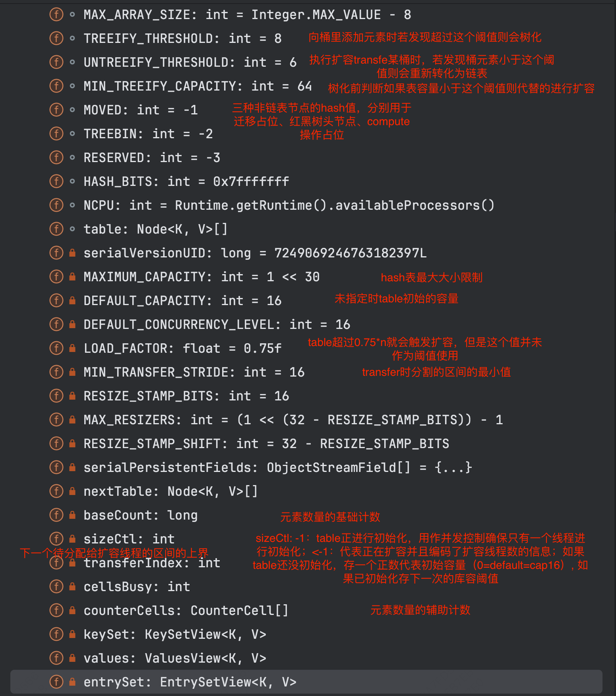
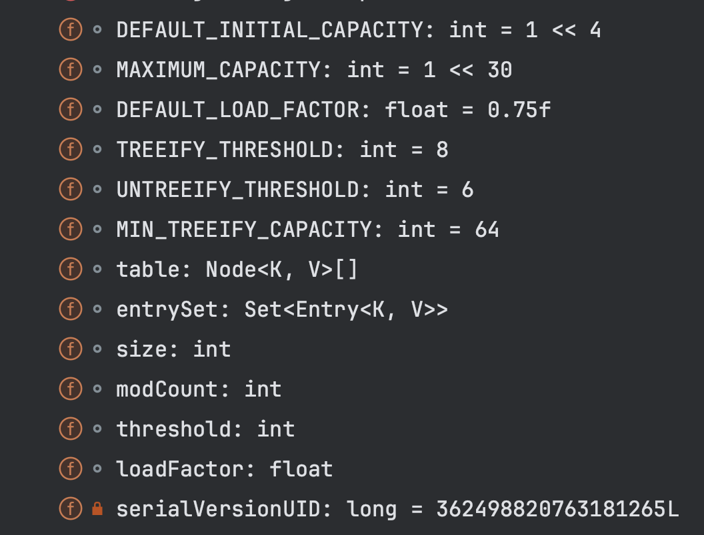

# ConcurrentHashMap vs HashMap vs HashTable
## 1. ConcurrentHashMap
为了并发读写而设计的k-v数据结构，基于hash表、链表和红黑树等数据结构。
put和get是线程安全的，其中get操作不会阻塞。如果一个put操作在get前结束，则get一定能看到put的结果


### 1.1 结构
这里只展示所有的field:


### 1.2 关键代码解读
#### 1.2.1 get
```java
    /**
     * Returns the value to which the specified key is mapped,
     * or {@code null} if this map contains no mapping for the key.
     *
     * <p>More formally, if this map contains a mapping from a key
     * {@code k} to a value {@code v} such that {@code key.equals(k)},
     * then this method returns {@code v}; otherwise it returns
     * {@code null}.  (There can be at most one such mapping.)
     *
     * @throws NullPointerException if the specified key is null
     */
    public V get(Object key) {
        Node<K,V>[] tab; Node<K,V> e, p; int n, eh; K ek;
        int h = spread(key.hashCode()); // 对hash值预处理减少hash冲突并防止出现负数
        if ((tab = table) != null && (n = tab.length) > 0 &&
            (e = tabAt(tab, (n - 1) & h)) != null) { // 能定位到node
            if ((eh = e.hash) == h) { // node是一个普通节点或者是一个链表但是头结点就是要找的元素
                if ((ek = e.key) == key || (ek != null && key.equals(ek)))
                    return e.val;
            }
            else if (eh < 0) 
            // 如果头节点的 hash 小于 0，说明 正在扩容（FORWARDING节点），或者该位置是红黑树（TREEBIN节点），
            // 或该节点值正进行计算（RESERVED节点，compute和computeIfAbsent操作中用到，因为在计算出该位置的值前需要先阻塞其他线程）
            // 对这个位置的写操作，当这个位置为null时无法用sync锁定，因此先放入了一个占位对象。调用它的find方法返回的是null
                return (p = e.find(h, key)) != null ? p.val : null;
            while ((e = e.next) != null) { // node是链表的头结点
                if (e.hash == h &&
                    ((ek = e.key) == key || (ek != null && key.equals(ek))))
                    return e.val;
            }
        }
        return null;
    }
    
    // 这段的意思是表达hash表使用2的幂次方的掩码（从hash->index只需做按位与掩码，比取余更快），只有哈希值的低位参与了位置的计算，容易发生哈希冲突，所以进行了扩散的操作来减少
    // 另外通过&HASH_BITS来让最高位符号位恒为0
    /**
     * Spreads (XORs) higher bits of hash to lower and also forces top
     * bit to 0. Because the table uses power-of-two masking, sets of
     * hashes that vary only in bits above the current mask will
     * always collide. (Among known examples are sets of Float keys
     * holding consecutive whole numbers in small tables.)  So we
     * apply a transform that spreads the impact of higher bits
     * downward. There is a tradeoff between speed, utility, and
     * quality of bit-spreading. Because many common sets of hashes
     * are already reasonably distributed (so don't benefit from
     * spreading), and because we use trees to handle large sets of
     * collisions in bins, we just XOR some shifted bits in the
     * cheapest possible way to reduce systematic lossage, as well as
     * to incorporate impact of the highest bits that would otherwise
     * never be used in index calculations because of table bounds.
     */
    static final int spread(int h) {
        return (h ^ (h >>> 16)) & HASH_BITS;
    }
    
    // 获取tab[i]位置的元素，保证volatile的原子和有序性
    /*
     * Volatile access methods are used for table elements as well as
     * elements of in-progress next table while resizing.  All uses of
     * the tab arguments must be null checked by callers.  All callers
     * also paranoically precheck that tab's length is not zero (or an
     * equivalent check), thus ensuring that any index argument taking
     * the form of a hash value anded with (length - 1) is a valid
     * index.  Note that, to be correct wrt arbitrary concurrency
     * errors by users, these checks must operate on local variables,
     * which accounts for some odd-looking inline assignments below.
     * Note that calls to setTabAt always occur within locked regions,
     * and so in principle require only release ordering, not
     * full volatile semantics, but are currently coded as volatile
     * writes to be conservative.
     */
    @SuppressWarnings("unchecked")
    static final <K,V> Node<K,V> tabAt(Node<K,V>[] tab, int i) {
        return (Node<K,V>)U.getObjectVolatile(tab, ((long)i << ASHIFT) + ABASE);
    }
```

#### 1.2.2 put
```java

    /**
     * Maps the specified key to the specified value in this table.
     * Neither the key nor the value can be null.
     *
     * <p>The value can be retrieved by calling the {@code get} method
     * with a key that is equal to the original key.
     *
     * @param key key with which the specified value is to be associated
     * @param value value to be associated with the specified key
     * @return the previous value associated with {@code key}, or
     *         {@code null} if there was no mapping for {@code key}
     * @throws NullPointerException if the specified key or value is null
     */
    public V put(K key, V value) {
        return putVal(key, value, false);
    }
    

    /** Implementation for put and putIfAbsent */
    final V putVal(K key, V value, boolean onlyIfAbsent) {
        // ConcurrentHashMap不允许key和value为null是为了防止二义性。在普通HashMap中如果存在一个键或值为null，在知道key的情况下可硬用containsKey来判断
        // 表中时存在还是不存在。但是由于并发情况下get和containsKey不是原子的（或者假设设计时对这俩操作同步，那并发度就很差），导致不能进行有效的判断。
        // 此外ConcurrentHashMap中value为null时被作为特殊的标记用于处理哈希冲突和节点迁移等情况，额外处理的话可能会造成性能问题
        if (key == null || value == null) throw new NullPointerException();
        int hash = spread(key.hashCode());
        int binCount = 0;
        for (Node<K,V>[] tab = table;;) {
            Node<K,V> f; int n, i, fh;
            // 需要初始化表的情况
            if (tab == null || (n = tab.length) == 0) 
                tab = initTable();
            // 如果是一个空桶，乐观锁更新（外层for+CAS）
            else if ((f = tabAt(tab, i = (n - 1) & hash)) == null) {
                if (casTabAt(tab, i, null,
                             new Node<K,V>(hash, key, value, null)))
                    break;                   // no lock when adding to empty bin
            }
            // 扩容状态下的节点，hash = -1，调帮助函数：准入判断是否参与扩容，是则进入扩容流程
            else if ((fh = f.hash) == MOVED)
                tab = helpTransfer(tab, f);
            else {
                V oldVal = null;
                // 非空桶，桶粒度的加锁
                synchronized (f) {
                    if (tabAt(tab, i) == f) { // double check桶没变
                        if (fh >= 0) { // hash大于0说明桶里是链表
                            binCount = 1; // 链表节点计数，方便判断是否要treeify
                            for (Node<K,V> e = f;; ++binCount) {
                                K ek;
                                if (e.hash == hash &&
                                    ((ek = e.key) == key ||
                                     (ek != null && key.equals(ek)))) {
                                    oldVal = e.val;
                                    if (!onlyIfAbsent)
                                        e.val = value;
                                    break;
                                }
                                Node<K,V> pred = e;
                                if ((e = e.next) == null) {
                                    pred.next = new Node<K,V>(hash, key,
                                                              value, null);
                                    break;
                                }
                            }
                        }
                        else if (f instanceof TreeBin) { // 否则是红黑树
                            Node<K,V> p;
                            binCount = 2;
                            if ((p = ((TreeBin<K,V>)f).putTreeVal(hash, key,
                                                           value)) != null) {
                                oldVal = p.val;
                                if (!onlyIfAbsent)
                                    p.val = value;
                            }
                        }
                    }
                }
                if (binCount != 0) { 
                    if (binCount >= TREEIFY_THRESHOLD) // 大于8要treeify
                        treeifyBin(tab, i);
                    if (oldVal != null)
                        return oldVal;
                    break;
                }
            }
        }
        // 增加map大小的计数&扩容核心操作，如果满足条件则需要扩容
        addCount(1L, binCount);
        return null;
    }
    
    /**
     * Adds to count, and if table is too small and not already
     * resizing, initiates transfer. If already resizing, helps
     * perform transfer if work is available.  Rechecks occupancy
     * after a transfer to see if another resize is already needed
     * because resizings are lagging additions.
     *
     * @param x the count to add
     * @param check if <0, don't check resize, if <= 1 only check if uncontended
     */
    private final void addCount(long x, int check) {
        CounterCell[] as; long b, s;
        /**
        * 增加计数，采用和LongAdder相同的实现方式。相比于AtomicLong的方式拥有更大的吞吐量，适用于并发冲突多的情况下。
        * 原理是使用一个Cell[]数组来分别计数每个线程的累加计数，这些辅助计数会被原子的更新。(未并发冲突会CAS直接更新主计数BaseCount)一个线程累加会使用其绑定的随机数&掩码的下标
        * 当两个线程CAS更新同一个辅助计数并发冲突时会重新分配probe随机值来尽可能解决冲突
        * 由于并行线程数<=cpu数且数组大小保持2的幂次方便掩码。所以数组最大的理论大小被限制在大于cpu数的最小2的幂次方。
        * 注意这个数组初始大小是2，仅当检测到并发冲突时尝试扩容
        */
        if ((as = counterCells) != null ||
            !U.compareAndSwapLong(this, BASECOUNT, b = baseCount, s = b + x)) {
            CounterCell a; long v; int m;
            boolean uncontended = true;
            if (as == null || (m = as.length - 1) < 0 ||
                (a = as[ThreadLocalRandom.getProbe() & m]) == null ||
                !(uncontended =
                  U.compareAndSwapLong(a, CELLVALUE, v = a.value, v + x))) {
                fullAddCount(x, uncontended);
                return;
            }
            if (check <= 1)
                return;
            s = sumCount();
        }
        if (check >= 0) {
            Node<K,V>[] tab, nt; int n, sc;
            while (s >= (long)(sc = sizeCtl) && (tab = table) != null &&
                   (n = tab.length) < MAXIMUM_CAPACITY) {
                int rs = resizeStamp(n);
                if (sc < 0) {
                    if ((sc >>> RESIZE_STAMP_SHIFT) != rs || sc == rs + 1 ||
                        sc == rs + MAX_RESIZERS || (nt = nextTable) == null ||
                        transferIndex <= 0)
                        break;
                    if (U.compareAndSwapInt(this, SIZECTL, sc, sc + 1))
                        transfer(tab, nt);
                }
                else if (U.compareAndSwapInt(this, SIZECTL, sc,
                                             (rs << RESIZE_STAMP_SHIFT) + 2))
                    transfer(tab, null);
                s = sumCount();
            }
        }
    }
    
    
    /**
     * Moves and/or copies the nodes in each bin to new table. See
     * above for explanation.
     */
    private final void transfer(Node<K,V>[] tab, Node<K,V>[] nextTab) {
        // 计算stride值，最大为n最小为16(MIN_TRANSFER_STRIDE)
        int n = tab.length, stride;
        if ((stride = (NCPU > 1) ? (n >>> 3) / NCPU : n) < MIN_TRANSFER_STRIDE)
            stride = MIN_TRANSFER_STRIDE; // subdivide range
        if (nextTab == null) {            // initiating
            try {
                @SuppressWarnings("unchecked")
                Node<K,V>[] nt = (Node<K,V>[])new Node<?,?>[n << 1];
                nextTab = nt;
            } catch (Throwable ex) {      // try to cope with OOME
                sizeCtl = Integer.MAX_VALUE;
                return;
            }
            nextTable = nextTab;
            transferIndex = n;
        }
        int nextn = nextTab.length;
        ForwardingNode<K,V> fwd = new ForwardingNode<K,V>(nextTab);
        boolean advance = true;
        boolean finishing = false; // to ensure sweep before committing nextTab
        for (int i = 0, bound = 0;;) {
            Node<K,V> f; int fh;
            while (advance) { // 这个循环的作用就是分配区间给当前线程（从后往前切），并且如果所有区间都分配完也会退出
                int nextIndex, nextBound;
                if (--i >= bound || finishing)
                    advance = false;
                else if ((nextIndex = transferIndex) <= 0) {
                    i = -1;
                    advance = false;
                }
                else if (U.compareAndSwapInt
                         (this, TRANSFERINDEX, nextIndex,
                          nextBound = (nextIndex > stride ?
                                       nextIndex - stride : 0))) { // transferIndex记录本次分配的区间的下界，下次分配区间时将其作为上界切大小为stride区间。 
                    bound = nextBound;
                    i = nextIndex - 1;
                    advance = false;
                }
            }
            if (i < 0 || i >= n || i + n >= nextn) {
                int sc;
                if (finishing) { // 当前线程是最后一个参与扩容的线程，swap table后退出
                    nextTable = null;
                    table = nextTab;
                    sizeCtl = (n << 1) - (n >>> 1);
                    return;
                }
                if (U.compareAndSwapInt(this, SIZECTL, sc = sizeCtl, sc - 1)) { // sizeCtl的线程计数-1
                    if ((sc - 2) != resizeStamp(n) << RESIZE_STAMP_SHIFT) // 说明还有其他帮助扩容的线程没结束，直接退出
                        return;
                    finishing = advance = true; // 否则说明是最后一个帮助扩容的线程了，修改finishing，再次循环会进入上面那个if并swap table
                    i = n; // recheck before commit
                }
            }
            else if ((f = tabAt(tab, i)) == null) // 以下三个分支分别处理当前桶为null、forward以及里面装链表/红黑树的情况
                advance = casTabAt(tab, i, null, fwd);
            else if ((fh = f.hash) == MOVED)
                advance = true; // already processed
            else {
                synchronized (f) {
                    if (tabAt(tab, i) == f) {
                        Node<K,V> ln, hn;
                        if (fh >= 0) {
                            int runBit = fh & n;
                            Node<K,V> lastRun = f;
                            for (Node<K,V> p = f.next; p != null; p = p.next) {
                                int b = p.hash & n;
                                if (b != runBit) {
                                    runBit = b;
                                    lastRun = p;
                                }
                            }
                            if (runBit == 0) {
                                ln = lastRun;
                                hn = null;
                            }
                            else {
                                hn = lastRun;
                                ln = null;
                            }
                            for (Node<K,V> p = f; p != lastRun; p = p.next) {
                                int ph = p.hash; K pk = p.key; V pv = p.val;
                                if ((ph & n) == 0)
                                    ln = new Node<K,V>(ph, pk, pv, ln);
                                else
                                    hn = new Node<K,V>(ph, pk, pv, hn);
                            }
                            setTabAt(nextTab, i, ln);
                            setTabAt(nextTab, i + n, hn);
                            setTabAt(tab, i, fwd);
                            advance = true;
                        }
                        else if (f instanceof TreeBin) {
                            TreeBin<K,V> t = (TreeBin<K,V>)f;
                            TreeNode<K,V> lo = null, loTail = null;
                            TreeNode<K,V> hi = null, hiTail = null;
                            int lc = 0, hc = 0;
                            for (Node<K,V> e = t.first; e != null; e = e.next) {
                                int h = e.hash;
                                TreeNode<K,V> p = new TreeNode<K,V>
                                    (h, e.key, e.val, null, null);
                                if ((h & n) == 0) {
                                    if ((p.prev = loTail) == null)
                                        lo = p;
                                    else
                                        loTail.next = p;
                                    loTail = p;
                                    ++lc;
                                }
                                else {
                                    if ((p.prev = hiTail) == null)
                                        hi = p;
                                    else
                                        hiTail.next = p;
                                    hiTail = p;
                                    ++hc;
                                }
                            }
                            ln = (lc <= UNTREEIFY_THRESHOLD) ? untreeify(lo) :
                                (hc != 0) ? new TreeBin<K,V>(lo) : t;
                            hn = (hc <= UNTREEIFY_THRESHOLD) ? untreeify(hi) :
                                (lc != 0) ? new TreeBin<K,V>(hi) : t;
                            setTabAt(nextTab, i, ln);
                            setTabAt(nextTab, i + n, hn);
                            setTabAt(tab, i, fwd);
                            advance = true;
                        }
                    }
                }
            }
        }
    }
    
```


#### 1.2.3 clear
```java

    /**
     * Removes all of the mappings from this map.
     */
    public void clear() {
        long delta = 0L; // negative number of deletions
        int i = 0;
        Node<K,V>[] tab = table;
        // 一次清理所有桶，若遇到transfer的桶需要帮助扩容完后再清理。table粒度上没有上锁可以和put并发
        while (tab != null && i < tab.length) {
            int fh;
            Node<K,V> f = tabAt(tab, i);
            if (f == null)
                ++i;
            else if ((fh = f.hash) == MOVED) {
                tab = helpTransfer(tab, f);
                i = 0; // restart
            }
            else {
                synchronized (f) {
                    if (tabAt(tab, i) == f) {
                        Node<K,V> p = (fh >= 0 ? f :
                                       (f instanceof TreeBin) ?
                                       ((TreeBin<K,V>)f).first : null);
                        while (p != null) {
                            --delta;
                            p = p.next;
                        }
                        setTabAt(tab, i++, null);
                    }
                }
            }
        }
        if (delta != 0L)
            addCount(delta, -1);
    }
```

## 2. HashMap
### 2.1 结构

modCount: HashMap中用来控制fast-fail的，即如果在迭代过程中集合被修改了，则会throw ConcurrentModificationException。
原理是创建迭代器时记录modCount值，执行next或remove操作时如果值变化了则抛异常

### 2.2 关键代码解读
```java
    /**
     * Associates the specified value with the specified key in this map.
     * If the map previously contained a mapping for the key, the old
     * value is replaced.
     *
     * @param key key with which the specified value is to be associated
     * @param value value to be associated with the specified key
     * @return the previous value associated with <tt>key</tt>, or
     *         <tt>null</tt> if there was no mapping for <tt>key</tt>.
     *         (A <tt>null</tt> return can also indicate that the map
     *         previously associated <tt>null</tt> with <tt>key</tt>.)
     */
    public V put(K key, V value) {
        return putVal(hash(key), key, value, false, true);
    }

    /**
     * Implements Map.put and related methods
     *
     * @param hash hash for key
     * @param key the key
     * @param value the value to put
     * @param onlyIfAbsent if true, don't change existing value
     * @param evict if false, the table is in creation mode.
     * @return previous value, or null if none
     */
    final V putVal(int hash, K key, V value, boolean onlyIfAbsent,
                   boolean evict) {
        Node<K,V>[] tab; Node<K,V> p; int n, i;
        if ((tab = table) == null || (n = tab.length) == 0)
        // 初始化
            n = (tab = resize()).length;
        if ((p = tab[i = (n - 1) & hash]) == null)
            tab[i] = newNode(hash, key, value, null);
        else {
            Node<K,V> e; K k;
            if (p.hash == hash &&
                ((k = p.key) == key || (key != null && key.equals(k))))
                e = p;
            else if (p instanceof TreeNode)
                e = ((TreeNode<K,V>)p).putTreeVal(this, tab, hash, key, value);
            else {
                for (int binCount = 0; ; ++binCount) {
                    if ((e = p.next) == null) {
                        p.next = newNode(hash, key, value, null);
                        if (binCount >= TREEIFY_THRESHOLD - 1) // -1 for 1st
                            // 树化
                            treeifyBin(tab, hash);
                        break;
                    }
                    if (e.hash == hash &&
                        ((k = e.key) == key || (key != null && key.equals(k))))
                        break;
                    p = e;
                }
            }
            if (e != null) { // existing mapping for key
                V oldValue = e.value;
                if (!onlyIfAbsent || oldValue == null)
                    e.value = value;
                afterNodeAccess(e);
                return oldValue;
            }
        }
        ++modCount;
        if (++size > threshold)
        // 扩容操作
            resize();
        afterNodeInsertion(evict);
        return null;
    }

    /**
     * Initializes or doubles table size.  If null, allocates in
     * accord with initial capacity target held in field threshold.
     * Otherwise, because we are using power-of-two expansion, the
     * elements from each bin must either stay at same index, or move
     * with a power of two offset in the new table.
     *
     * @return the table
     */
    final Node<K,V>[] resize() {
        Node<K,V>[] oldTab = table;
        int oldCap = (oldTab == null) ? 0 : oldTab.length;
        int oldThr = threshold;
        int newCap, newThr = 0;
        // 确定初始化的cap或扩容后的cap并建新表
        if (oldCap > 0) {
            if (oldCap >= MAXIMUM_CAPACITY) {
                threshold = Integer.MAX_VALUE;
                return oldTab;
            }
            else if ((newCap = oldCap << 1) < MAXIMUM_CAPACITY &&
                     oldCap >= DEFAULT_INITIAL_CAPACITY)
                newThr = oldThr << 1; // double threshold
        }
        else if (oldThr > 0) // initial capacity was placed in threshold
            newCap = oldThr;
        else {               // zero initial threshold signifies using defaults
            newCap = DEFAULT_INITIAL_CAPACITY;
            newThr = (int)(DEFAULT_LOAD_FACTOR * DEFAULT_INITIAL_CAPACITY);
        }
        if (newThr == 0) {
            float ft = (float)newCap * loadFactor;
            newThr = (newCap < MAXIMUM_CAPACITY && ft < (float)MAXIMUM_CAPACITY ?
                      (int)ft : Integer.MAX_VALUE);
        }
        threshold = newThr;
        @SuppressWarnings({"rawtypes","unchecked"})
            Node<K,V>[] newTab = (Node<K,V>[])new Node[newCap];
        table = newTab;
        if (oldTab != null) {
            for (int j = 0; j < oldCap; ++j) {
                Node<K,V> e;
                if ((e = oldTab[j]) != null) { // 普通节点
                    oldTab[j] = null;
                    if (e.next == null)
                        newTab[e.hash & (newCap - 1)] = e;
                    else if (e instanceof TreeNode) // 树节点
                        ((TreeNode<K,V>)e).split(this, newTab, j, oldCap);
                    else { // preserve order
                        // 链表节点，
                        Node<K,V> loHead = null, loTail = null;
                        Node<K,V> hiHead = null, hiTail = null;
                        Node<K,V> next;
                        do {
                            next = e.next;
                            if ((e.hash & oldCap) == 0) { // 例：假设oldCap = 10000，e.hash = 00010时 e.hash & oldCap还是00010分配至低筒。但hash的msb是1则算出分配到高桶
                                if (loTail == null)
                                    loHead = e;
                                else
                                    loTail.next = e;
                                loTail = e;
                            }
                            else {
                                if (hiTail == null)
                                    hiHead = e;
                                else
                                    hiTail.next = e;
                                hiTail = e;
                            }
                        } while ((e = next) != null);
                        if (loTail != null) {
                            loTail.next = null;
                            newTab[j] = loHead;
                        }
                        if (hiTail != null) {
                            hiTail.next = null;
                            newTab[j + oldCap] = hiHead;
                        }
                    }
                }
            }
        }
        return newTab;
    }
```

看put代码比CMAP简单很多，因为无论在初始化、扩容和向桶中添加元素、树化时都无需并发控制。

## 3. HashTable
### 3.1 结构

### 3.2 关键代码解读
```java
    public synchronized V get(Object key) {
        Entry<?,?> tab[] = table;
        int hash = key.hashCode();
        int index = (hash & 0x7FFFFFFF) % tab.length;
        for (Entry<?,?> e = tab[index] ; e != null ; e = e.next) {
            if ((e.hash == hash) && e.key.equals(key)) {
                return (V)e.value;
            }
        }
        return null;
    }

    public synchronized V put(K key, V value) {
        // Make sure the value is not null
        if (value == null) {
        throw new NullPointerException();
        }
    
        // Makes sure the key is not already in the hashtable.
        Entry<?,?> tab[] = table;
        int hash = key.hashCode();
        int index = (hash & 0x7FFFFFFF) % tab.length;
    @SuppressWarnings("unchecked")
            Entry<K,V> entry = (Entry<K,V>)tab[index];
        for(; entry != null ; entry = entry.next) {
        if ((entry.hash == hash) && entry.key.equals(key)) {
        V old = entry.value;
        entry.value = value;
        return old;
        }
        }
    
        addEntry(hash, key, value, index);
        return null;
    }
```
可见get和put操作全部方法粒度上锁定，并且hash冲突全部用链表解决没用红黑树优化

## 4. 引申：redis
谈到hash表，不同实现重点是什么？(1) kv支持的类型（2）hash冲突的解决方式（3）扩缩容的方式（4）并发数据结构：读写并发的处理方式

由于redis常用于分布式场景下的kv存储，所以联想可做下对比
1. redis的键是string，值可以是string、list、hash、set、sorted set中的一种
2. redis解决hash冲突用的是开链法，没用树结构
3. redis get和set无需并发控制因为其对字典的操作是单线程的
3. redis扩容的触发条件是：BGSAVE或BGREWRITEAOF时元素数量>=5*容量或者非这两操作是>=1。
4. 扩容初始时分配一张新表，容量是大于当前元素数量最接近的2的整数次幂的数字。
   扩容操作期间维护一个rehashIndex，每次增删改查操作都会将rehashIndex桶中的所有元素rehash，并自增rehashIndex。
   每次查询操作会查新老表，查不到查新表；每次写操作只会写新表。
5. redis hash表存在缩容操作，触发条件是：元素数量小于容量的1/10，其他过程类似